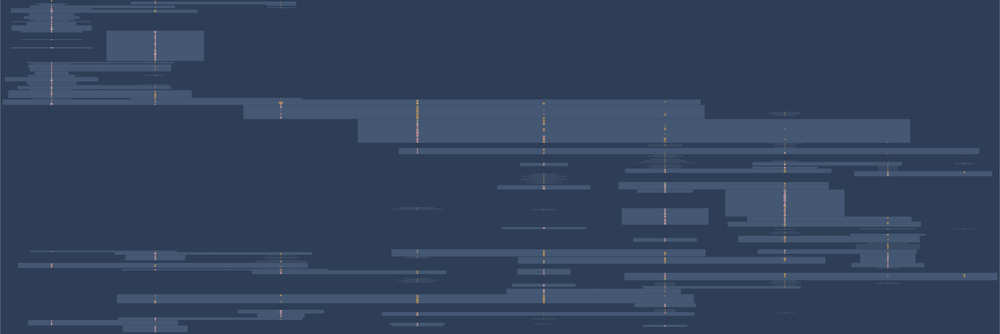

# DCHF Contracts

## General Information

This repository was initially forked from vesta finance (link) and was changed in order to be deployable on Ethereum Mainnet. It deploys all contracts for the DCHF ecosystem and sets them up.

## Changes

The main changes from the fork were done such that the contracts are deployable on mainnet. Vesta Finance deployed the contracts on Arbitrum which does not have a max byte size limit for contracts. Therefore, the TroveManager.sol was over 25kb of size and needed to be split up into TroveManager.sol and TroveManagerHelpers.sol.

In Addition, the repository was cleaned up such that it can only be deployed to Ethereum mainnet and the Goerli testnet. Many scripts, tests, helpers etc. were removed.

## Deployed Contracts

- MONToken: 0x1EA48B9965bb5086F3b468E50ED93888a661fc17
- gasPool: 0xC9A113C35f961af3526E6F016F6DF9DA0A4c7BfA
- sortedTroves: 0x1Dd69453a685C735f2ab43E2169b57e9Edf72286
- troveManager: 0x99838142189adE67c1951f9c57c3333281334F7F
- troveManagerHelpers: 0xaAACB8C39Bd5Acbb0A236112Df8d15411161e518
- activePool: 0x77E034c8A1392d99a2C776A6C1593866fEE36a33
- stabilityPoolManager: 0x202FbFF035188f9f0525E144C8B3F8249a74aD21
- defaultPool: 0xC1f785B74a01dd9FAc0dE6070bC583fe9eaC7Ab5
- collSurplusPool: 0xA622c3bdBFBE749B1984bc127bFB500e196F594b
- borrowerOperations: 0x9eB2Ce1be2DD6947e4f5Aabe33106f48861DFD74
- hintHelpers: 0x17244338034Bea1fA940779Bc769Ff01833406c4
- dfrancParameters: 0x6F9990B242873d7396511f2630412A3fcEcacc42
- priceFeed: 0x09AB3C0ce6Cb41C13343879A667a6bDAd65ee9DA
- adminContract: 0x2748C55219DCa1D9D3c3a57505e99BB04e42F254
- DCHFToken: 0x045da4bFe02B320f4403674B3b7d121737727A36
- MONStaking: 0x8Bc3702c35D33E5DF7cb0F06cb72a0c34Ae0C56F
- communityIssuance: 0x0fa46e8cBCEff8468DB2Ec2fD77731D8a11d3D86
- StabilityPoolETH: 0x6a9f9d6F5D672a9784c5E560a9648de6cbe2c548
- StabilityPoolBTC: 0x04556d845f12Ff7D8Ff04a37F40387Dd1B454c4b
- multiTroveGetter: 0xD4EcC372E99daBDbc0faBE02d2515a24388fACcA

## Deployment

Do the following steps to deploy the whole infrastructure:

1. Run `npm i`
2. Create a `secrets.js` from the template `secrets.js.template` file. Add the `INFURA_API_KEY`, the `DEPLOYER_PRIVATEKEY` and the `ETHERSCAN_API_KEY` for mainnet deployment (or the Goerli parameters for testnet deployment).
3. Update the addresses on lines 16-18 in `deployment/deploymentParams/deploymentParams.mainnet.js` (or the goerli file for testnet deployment) to reflect your specific setting. The Deployer address needs to reflect the private key set in the `secrets.js` file. Verify the oracle addresses on lines 5-18. The parameter `GAS_PRICE` should be fine and your deploy transactions risk getting stuck if the value is changed.
4. You can choose to either deploy only the MONETA contracts (moneta token, vesting) or the whole infrastructure. Set the parameter `MON_TOKEN_ONLY` to handle this
5. Run `npx hardhat run deployment/deploymentScripts/mainnetDeployment.js --network mainnet` (or the Goerli references for testnet deployment), to deploy the contracts.
6. You can check and verify the contracts by checking the output file in `deployment/output/mainnetDeploymentOutput.json`.

## Important Notes

The contract DfrancParameters.sol contains all the parameters from the system and should not be modified. However, the system is set to block redemptions in it's first 14 days. For testing purposes, it's recommended to change it for a lower value. You can find it on the line 15.

-> Call Diagram

Contracts Description Table

|  Contract  |         Type        |       Bases      |                  |                 |
|:----------:|:-------------------:|:----------------:|:----------------:|:---------------:|
|     └      |  **Function Name**  |  **Visibility**  |  **Mutability**  |  **Modifiers**  |
||||||
| **AdminContract** | Implementation | ProxyAdmin |||
| └ | setAddresses | External ❗️ | 🛑  | onlyOwner |
| └ | addNewCollateral | External ❗️ | 🛑  | onlyOwner |
||||||
| **CollSurplusPool** | Implementation | OwnableUpgradeable, CheckContract, ICollSurplusPool |||
| └ | setAddresses | External ❗️ | 🛑  | initializer |
| └ | getAssetBalance | External ❗️ |   |NO❗️ |
| └ | getCollateral | External ❗️ |   |NO❗️ |
| └ | accountSurplus | External ❗️ | 🛑  |NO❗️ |
| └ | claimColl | External ❗️ | 🛑  |NO❗️ |
| └ | receivedERC20 | External ❗️ | 🛑  |NO❗️ |
| └ | _requireCallerIsBorrowerOperations | Internal 🔒 |   | |
| └ | _requireCallerIsTroveManager | Internal 🔒 |   | |
| └ | _requireCallerIsActivePool | Internal 🔒 |   | |
| └ | <Receive Ether> | External ❗️ |  💵 |NO❗️ |
||||||
| **BorrowerOperations** | Implementation | DfrancBase, CheckContract, IBorrowerOperations |||
| └ | setAddresses | External ❗️ | 🛑  | initializer |
| └ | openTrove | External ❗️ |  💵 |NO❗️ |
| └ | addColl | External ❗️ |  💵 |NO❗️ |
| └ | moveETHGainToTrove | External ❗️ |  💵 |NO❗️ |
| └ | withdrawColl | External ❗️ | 🛑  |NO❗️ |
| └ | withdrawDCHF | External ❗️ | 🛑  |NO❗️ |
| └ | repayDCHF | External ❗️ | 🛑  |NO❗️ |
| └ | adjustTrove | External ❗️ |  💵 |NO❗️ |
| └ | _adjustTrove | Internal 🔒 | 🛑  | |
| └ | closeTrove | External ❗️ | 🛑  |NO❗️ |
| └ | claimCollateral | External ❗️ | 🛑  |NO❗️ |
| └ | _triggerBorrowingFee | Internal 🔒 | 🛑  | |
| └ | _getUSDValue | Internal 🔒 |   | |
| └ | _getCollChange | Internal 🔒 |   | |
| └ | _updateTroveFromAdjustment | Internal 🔒 | 🛑  | |
| └ | _moveTokensAndETHfromAdjustment | Internal 🔒 | 🛑  | |
| └ | _activePoolAddColl | Internal 🔒 | 🛑  | |
| └ | _withdrawDCHF | Internal 🔒 | 🛑  | |
| └ | _repayDCHF | Internal 🔒 | 🛑  | |
| └ | _requireSingularCollChange | Internal 🔒 |   | |
| └ | _requireCallerIsBorrower | Internal 🔒 |   | |
| └ | _requireNonZeroAdjustment | Internal 🔒 |   | |
| └ | _requireTroveisActive | Internal 🔒 |   | |
| └ | _requireTroveisNotActive | Internal 🔒 |   | |
| └ | _requireNonZeroDebtChange | Internal 🔒 |   | |
| └ | _requireNotInRecoveryMode | Internal 🔒 |   | |
| └ | _requireNoCollWithdrawal | Internal 🔒 |   | |
| └ | _requireValidAdjustmentInCurrentMode | Internal 🔒 |   | |
| └ | _requireICRisAboveMCR | Internal 🔒 |   | |
| └ | _requireICRisAboveCCR | Internal 🔒 |   | |
| └ | _requireNewICRisAboveOldICR | Internal 🔒 |   | |
| └ | _requireNewTCRisAboveCCR | Internal 🔒 |   | |
| └ | _requireAtLeastMinNetDebt | Internal 🔒 |   | |
| └ | _requireValidDCHFRepayment | Internal 🔒 |   | |
| └ | _requireCallerIsStabilityPool | Internal 🔒 |   | |
| └ | _requireSufficientDCHFBalance | Internal 🔒 |   | |
| └ | _requireValidMaxFeePercentage | Internal 🔒 |   | |
| └ | _getNewNominalICRFromTroveChange | Internal 🔒 |   | |
| └ | _getNewICRFromTroveChange | Internal 🔒 |   | |
| └ | _getNewTroveAmounts | Internal 🔒 |   | |
| └ | _getNewTCRFromTroveChange | Internal 🔒 |   | |
| └ | getCompositeDebt | External ❗️ |   |NO❗️ |
| └ | getMethodValue | Private 🔐 |   | |
||||||
| **ActivePool** | Implementation | OwnableUpgradeable, ReentrancyGuardUpgradeable, CheckContract, IActivePool |||
| └ | setAddresses | External ❗️ | 🛑  | initializer |
| └ | getAssetBalance | External ❗️ |   |NO❗️ |
| └ | getDCHFDebt | External ❗️ |   |NO❗️ |
| └ | sendAsset | External ❗️ | 🛑  | nonReentrant callerIsBOorTroveMorSP |
| └ | isERC20DepositContract | Private 🔐 |   | |
| └ | increaseDCHFDebt | External ❗️ | 🛑  | callerIsBOorTroveM |
| └ | decreaseDCHFDebt | External ❗️ | 🛑  | callerIsBOorTroveMorSP |
| └ | receivedERC20 | External ❗️ | 🛑  | callerIsBorrowerOperationOrDefaultPool |
| └ | <Receive Ether> | External ❗️ |  💵 | callerIsBorrowerOperationOrDefaultPool |
||||||
| **MultiTroveGetter** | Implementation |  |||
| └ | <Constructor> | Public ❗️ | 🛑  |NO❗️ |
| └ | getMultipleSortedTroves | External ❗️ |   |NO❗️ |
| └ | _getMultipleSortedTrovesFromHead | Internal 🔒 |   | |
| └ | _getMultipleSortedTrovesFromTail | Internal 🔒 |   | |
||||||
| **PriceFeed** | Implementation | OwnableUpgradeable, CheckContract, BaseMath, IPriceFeed |||
| └ | setAddresses | External ❗️ | 🛑  | initializer |
| └ | setAdminContract | External ❗️ | 🛑  | onlyOwner |
| └ | addOracle | External ❗️ | 🛑  | isController |
| └ | fetchPrice | External ❗️ | 🛑  |NO❗️ |
| └ | _getIndexedPrice | Internal 🔒 |   | |
| └ | _getChainlinkResponses | Internal 🔒 |   | |
| └ | _chainlinkIsBroken | Internal 🔒 |   | |
| └ | _badChainlinkResponse | Internal 🔒 |   | |
| └ | _chainlinkIsFrozen | Internal 🔒 |   | |
| └ | _chainlinkPriceChangeAboveMax | Internal 🔒 |   | |
| └ | _scaleChainlinkPriceByDigits | Internal 🔒 |   | |
| └ | _changeStatus | Internal 🔒 | 🛑  | |
| └ | _storeChainlinkIndex | Internal 🔒 | 🛑  | |
| └ | _storeChainlinkPrice | Internal 🔒 | 🛑  | |
| └ | _storePrice | Internal 🔒 | 🛑  | |
| └ | _storeIndex | Internal 🔒 | 🛑  | |
| └ | _getCurrentChainlinkResponse | Internal 🔒 |   | |
| └ | _getPrevChainlinkResponse | Internal 🔒 |   | |
||||||
| **TellorCaller** | Implementation | ITellorCaller |||
| └ | <Constructor> | Public ❗️ | 🛑  |NO❗️ |
| └ | getTellorCurrentValue | External ❗️ |   |NO❗️ |
||||||
| **SafetyTransfer** | Library |  |||
| └ | decimalsCorrection | Internal 🔒 |   | |
||||||
| **ITellor** | Interface |  |||
| └ | beginDispute | External ❗️ | 🛑  |NO❗️ |
| └ | vote | External ❗️ | 🛑  |NO❗️ |
| └ | tallyVotes | External ❗️ | 🛑  |NO❗️ |
| └ | proposeFork | External ❗️ | 🛑  |NO❗️ |
| └ | addTip | External ❗️ | 🛑  |NO❗️ |
| └ | submitMiningSolution | External ❗️ | 🛑  |NO❗️ |
| └ | submitMiningSolution | External ❗️ | 🛑  |NO❗️ |
| └ | proposeOwnership | External ❗️ | 🛑  |NO❗️ |
| └ | claimOwnership | External ❗️ | 🛑  |NO❗️ |
| └ | depositStake | External ❗️ | 🛑  |NO❗️ |
| └ | requestStakingWithdraw | External ❗️ | 🛑  |NO❗️ |
| └ | withdrawStake | External ❗️ | 🛑  |NO❗️ |
| └ | approve | External ❗️ | 🛑  |NO❗️ |
| └ | transfer | External ❗️ | 🛑  |NO❗️ |
| └ | transferFrom | External ❗️ | 🛑  |NO❗️ |
| └ | name | External ❗️ |   |NO❗️ |
| └ | symbol | External ❗️ |   |NO❗️ |
| └ | decimals | External ❗️ |   |NO❗️ |
| └ | getNewCurrentVariables | External ❗️ |   |NO❗️ |
| └ | getTopRequestIDs | External ❗️ |   |NO❗️ |
| └ | getNewVariablesOnDeck | External ❗️ |   |NO❗️ |
| └ | updateTellor | External ❗️ | 🛑  |NO❗️ |
| └ | unlockDisputeFee | External ❗️ | 🛑  |NO❗️ |
| └ | allowance | External ❗️ |   |NO❗️ |
| └ | allowedToTrade | External ❗️ |   |NO❗️ |
| └ | balanceOf | External ❗️ |   |NO❗️ |
| └ | balanceOfAt | External ❗️ |   |NO❗️ |
| └ | didMine | External ❗️ |   |NO❗️ |
| └ | didVote | External ❗️ |   |NO❗️ |
| └ | getAddressVars | External ❗️ |   |NO❗️ |
| └ | getAllDisputeVars | External ❗️ |   |NO❗️ |
| └ | getCurrentVariables | External ❗️ |   |NO❗️ |
| └ | getDisputeIdByDisputeHash | External ❗️ |   |NO❗️ |
| └ | getDisputeUintVars | External ❗️ |   |NO❗️ |
| └ | getLastNewValue | External ❗️ |   |NO❗️ |
| └ | getLastNewValueById | External ❗️ |   |NO❗️ |
| └ | getMinedBlockNum | External ❗️ |   |NO❗️ |
| └ | getMinersByRequestIdAndTimestamp | External ❗️ |   |NO❗️ |
| └ | getNewValueCountbyRequestId | External ❗️ |   |NO❗️ |
| └ | getRequestIdByRequestQIndex | External ❗️ |   |NO❗️ |
| └ | getRequestIdByTimestamp | External ❗️ |   |NO❗️ |
| └ | getRequestIdByQueryHash | External ❗️ |   |NO❗️ |
| └ | getRequestQ | External ❗️ |   |NO❗️ |
| └ | getRequestUintVars | External ❗️ |   |NO❗️ |
| └ | getRequestVars | External ❗️ |   |NO❗️ |
| └ | getStakerInfo | External ❗️ |   |NO❗️ |
| └ | getSubmissionsByTimestamp | External ❗️ |   |NO❗️ |
| └ | getTimestampbyRequestIDandIndex | External ❗️ |   |NO❗️ |
| └ | getUintVar | External ❗️ |   |NO❗️ |
| └ | getVariablesOnDeck | External ❗️ |   |NO❗️ |
| └ | isInDispute | External ❗️ |   |NO❗️ |
| └ | retrieveData | External ❗️ |   |NO❗️ |
| └ | totalSupply | External ❗️ |   |NO❗️ |
||||||
| **IERC2612** | Interface |  |||
| └ | permit | External ❗️ | 🛑  |NO❗️ |
| └ | nonces | External ❗️ |   |NO❗️ |
| └ | version | External ❗️ |   |NO❗️ |
| └ | permitTypeHash | External ❗️ |   |NO❗️ |
| └ | domainSeparator | External ❗️ |   |NO❗️ |
||||||
| **IERC2612Permit** | Interface |  |||
| └ | permit | External ❗️ | 🛑  |NO❗️ |
| └ | nonces | External ❗️ |   |NO❗️ |
||||||
| **ERC20Permit** | Implementation | ERC20, IERC2612Permit |||
| └ | <Constructor> | Public ❗️ | 🛑  |NO❗️ |
| └ | permit | Public ❗️ | 🛑  |NO❗️ |
| └ | nonces | Public ❗️ |   |NO❗️ |
| └ | chainId | Public ❗️ |   |NO❗️ |
||||||
| **ERC20Decimals** | Interface |  |||
| └ | decimals | External ❗️ |   |NO❗️ |
||||||
| **DfrancSafeMath128** | Library |  |||
| └ | add | Internal 🔒 |   | |
| └ | sub | Internal 🔒 |   | |
||||||
| **DfrancMath** | Library |  |||
| └ | _min | Internal 🔒 |   | |
| └ | _max | Internal 🔒 |   | |
| └ | decMul | Internal 🔒 |   | |
| └ | _decPow | Internal 🔒 |   | |
| └ | _getAbsoluteDifference | Internal 🔒 |   | |
| └ | _computeNominalCR | Internal 🔒 |   | |
| └ | _computeCR | Internal 🔒 |   | |
||||||
| **DfrancBase** | Implementation | BaseMath, IDfrancBase, OwnableUpgradeable |||
| └ | setDfrancParameters | Public ❗️ | 🛑  | onlyOwner |
| └ | _getCompositeDebt | Internal 🔒 |   | |
| └ | _getNetDebt | Internal 🔒 |   | |
| └ | _getCollGasCompensation | Internal 🔒 |   | |
| └ | getEntireSystemColl | Public ❗️ |   |NO❗️ |
| └ | getEntireSystemDebt | Public ❗️ |   |NO❗️ |
| └ | _getTCR | Internal 🔒 |   | |
| └ | _checkRecoveryMode | Internal 🔒 |   | |
| └ | _requireUserAcceptsFee | Internal 🔒 |   | |
||||||
| **CheckContract** | Implementation |  |||
| └ | checkContract | Internal 🔒 |   | |
||||||
| **BaseMath** | Implementation |  |||
||||||
| **TroveManagerHelpers** | Implementation | DfrancBase, CheckContract, ITroveManagerHelpers |||
| └ | _onlyBOorTM | Private 🔐 |   | |
| └ | _onlyBorrowerOperations | Private 🔐 |   | |
| └ | _onlyTroveManager | Private 🔐 |   | |
| └ | setAddresses | External ❗️ | 🛑  | initializer |
| └ | getNominalICR | Public ❗️ |   |NO❗️ |
| └ | getCurrentICR | Public ❗️ |   |NO❗️ |
| └ | _getCurrentTroveAmounts | Internal 🔒 |   | |
| └ | applyPendingRewards | External ❗️ | 🛑  | onlyBorrowerOperations |
| └ | applyPendingRewards | External ❗️ | 🛑  | onlyTroveManager |
| └ | _applyPendingRewards | Internal 🔒 | 🛑  | |
| └ | updateTroveRewardSnapshots | External ❗️ | 🛑  | onlyBorrowerOperations |
| └ | _updateTroveRewardSnapshots | Internal 🔒 | 🛑  | |
| └ | getPendingAssetReward | Public ❗️ |   |NO❗️ |
| └ | getPendingDCHFDebtReward | Public ❗️ |   |NO❗️ |
| └ | hasPendingRewards | Public ❗️ |   |NO❗️ |
| └ | getEntireDebtAndColl | Public ❗️ |   |NO❗️ |
| └ | removeStake | External ❗️ | 🛑  | onlyBOorTM |
| └ | removeStakeTrove | External ❗️ | 🛑  | onlyTroveManager |
| └ | _removeStake | Internal 🔒 | 🛑  | |
| └ | updateStakeAndTotalStakes | External ❗️ | 🛑  | onlyBorrowerOperations |
| └ | updateStakeAndTotalStakesTrove | External ❗️ | 🛑  | onlyTroveManager |
| └ | _updateStakeAndTotalStakes | Internal 🔒 | 🛑  | |
| └ | _computeNewStake | Internal 🔒 |   | |
| └ | redistributeDebtAndColl | External ❗️ | 🛑  | onlyTroveManager |
| └ | _redistributeDebtAndColl | Internal 🔒 | 🛑  | |
| └ | closeTrove | External ❗️ | 🛑  | onlyBorrowerOperations |
| └ | closeTrove | External ❗️ | 🛑  | onlyTroveManager |
| └ | _closeTrove | Internal 🔒 | 🛑  | |
| └ | updateSystemSnapshots_excludeCollRemainder | External ❗️ | 🛑  | onlyTroveManager |
| └ | _updateSystemSnapshots_excludeCollRemainder | Internal 🔒 | 🛑  | |
| └ | addTroveOwnerToArray | External ❗️ | 🛑  | onlyBorrowerOperations |
| └ | _addTroveOwnerToArray | Internal 🔒 | 🛑  | |
| └ | _removeTroveOwner | Internal 🔒 | 🛑  | |
| └ | getTCR | External ❗️ |   |NO❗️ |
| └ | checkRecoveryMode | External ❗️ |   |NO❗️ |
| └ | _checkPotentialRecoveryMode | Public ❗️ |   |NO❗️ |
| └ | updateBaseRateFromRedemption | External ❗️ | 🛑  | onlyTroveManager |
| └ | _updateBaseRateFromRedemption | Internal 🔒 | 🛑  | |
| └ | getRedemptionRate | Public ❗️ |   |NO❗️ |
| └ | getRedemptionRateWithDecay | Public ❗️ |   |NO❗️ |
| └ | _calcRedemptionRate | Internal 🔒 |   | |
| └ | _getRedemptionFee | Public ❗️ |   |NO❗️ |
| └ | getRedemptionFeeWithDecay | External ❗️ |   |NO❗️ |
| └ | _calcRedemptionFee | Internal 🔒 |   | |
| └ | getBorrowingRate | Public ❗️ |   |NO❗️ |
| └ | getBorrowingRateWithDecay | Public ❗️ |   |NO❗️ |
| └ | _calcBorrowingRate | Internal 🔒 |   | |
| └ | getBorrowingFee | External ❗️ |   |NO❗️ |
| └ | getBorrowingFeeWithDecay | External ❗️ |   |NO❗️ |
| └ | _calcBorrowingFee | Internal 🔒 |   | |
| └ | decayBaseRateFromBorrowing | External ❗️ | 🛑  | onlyBorrowerOperations |
| └ | _updateLastFeeOpTime | Internal 🔒 | 🛑  | |
| └ | _calcDecayedBaseRate | Public ❗️ |   |NO❗️ |
| └ | _minutesPassedSinceLastFeeOp | Internal 🔒 |   | |
| └ | _requireDCHFBalanceCoversRedemption | Public ❗️ |   |NO❗️ |
| └ | _requireMoreThanOneTroveInSystem | Internal 🔒 |   | |
| └ | _requireAmountGreaterThanZero | Public ❗️ |   |NO❗️ |
| └ | _requireTCRoverMCR | Public ❗️ |   |NO❗️ |
| └ | _requireValidMaxFeePercentage | Public ❗️ |   |NO❗️ |
| └ | isTroveActive | Public ❗️ |   |NO❗️ |
| └ | getTroveOwnersCount | External ❗️ |   |NO❗️ |
| └ | getTroveFromTroveOwnersArray | External ❗️ |   |NO❗️ |
| └ | getTrove | External ❗️ |   |NO❗️ |
| └ | getTroveStatus | External ❗️ |   |NO❗️ |
| └ | getTroveStake | External ❗️ |   |NO❗️ |
| └ | getTroveDebt | External ❗️ |   |NO❗️ |
| └ | getTroveColl | External ❗️ |   |NO❗️ |
| └ | setTroveDeptAndColl | External ❗️ | 🛑  | onlyBorrowerOperations |
| └ | setTroveStatus | External ❗️ | 🛑  | onlyBorrowerOperations |
| └ | decreaseTroveColl | External ❗️ | 🛑  | onlyBorrowerOperations |
| └ | increaseTroveDebt | External ❗️ | 🛑  | onlyBorrowerOperations |
| └ | decreaseTroveDebt | External ❗️ | 🛑  | onlyBorrowerOperations |
| └ | increaseTroveColl | External ❗️ | 🛑  | onlyBorrowerOperations |
| └ | movePendingTroveRewardsToActivePool | External ❗️ | 🛑  | onlyTroveManager |
| └ | _movePendingTroveRewardsToActivePool | Internal 🔒 | 🛑  | |
| └ | getRewardSnapshots | External ❗️ |   |NO❗️ |
||||||
| **TroveManager** | Implementation | DfrancBase, CheckContract, ITroveManager |||
| └ | setAddresses | External ❗️ | 🛑  | initializer |
| └ | liquidate | External ❗️ | 🛑  | troveIsActive |
| └ | _liquidateNormalMode | Internal 🔒 | 🛑  | |
| └ | _liquidateRecoveryMode | Internal 🔒 | 🛑  | |
| └ | _getOffsetAndRedistributionVals | Internal 🔒 |   | |
| └ | _getCappedOffsetVals | Internal 🔒 |   | |
| └ | liquidateTroves | External ❗️ | 🛑  |NO❗️ |
| └ | _getTotalsFromLiquidateTrovesSequence_RecoveryMode | Internal 🔒 | 🛑  | |
| └ | _getTotalsFromLiquidateTrovesSequence_NormalMode | Internal 🔒 | 🛑  | |
| └ | batchLiquidateTroves | Public ❗️ | 🛑  |NO❗️ |
| └ | _getTotalFromBatchLiquidate_RecoveryMode | Internal 🔒 | 🛑  | |
| └ | _getTotalsFromBatchLiquidate_NormalMode | Internal 🔒 | 🛑  | |
| └ | _addLiquidationValuesToTotals | Internal 🔒 |   | |
| └ | _sendGasCompensation | Internal 🔒 | 🛑  | |
| └ | _redeemCollateralFromTrove | Internal 🔒 | 🛑  | |
| └ | _redeemCloseTrove | Internal 🔒 | 🛑  | |
| └ | _isValidFirstRedemptionHint | Internal 🔒 |   | |
| └ | setRedemptionWhitelistStatus | External ❗️ | 🛑  | onlyOwner |
| └ | addUserToWhitelistRedemption | External ❗️ | 🛑  | onlyOwner |
| └ | removeUserFromWhitelistRedemption | External ❗️ | 🛑  | onlyOwner |
| └ | redeemCollateral | External ❗️ | 🛑  |NO❗️ |
||||||
| **StabilityPoolManager** | Implementation | OwnableUpgradeable, CheckContract, IStabilityPoolManager |||
| └ | setAddresses | External ❗️ | 🛑  | initializer |
| └ | setAdminContract | External ❗️ | 🛑  | onlyOwner |
| └ | isStabilityPool | External ❗️ |   |NO❗️ |
| └ | addStabilityPool | External ❗️ | 🛑  | isController |
| └ | removeStabilityPool | External ❗️ | 🛑  | isController |
| └ | getAssetStabilityPool | External ❗️ |   |NO❗️ |
| └ | unsafeGetAssetStabilityPool | External ❗️ |   |NO❗️ |
||||||
| **StabilityPool** | Implementation | DfrancBase, CheckContract, IStabilityPool |||
| └ | getNameBytes | External ❗️ |   |NO❗️ |
| └ | getAssetType | External ❗️ |   |NO❗️ |
| └ | setAddresses | External ❗️ | 🛑  | initializer |
| └ | getAssetBalance | External ❗️ |   |NO❗️ |
| └ | getTotalDCHFDeposits | External ❗️ |   |NO❗️ |
| └ | provideToSP | External ❗️ | 🛑  |NO❗️ |
| └ | withdrawFromSP | External ❗️ | 🛑  |NO❗️ |
| └ | withdrawAssetGainToTrove | External ❗️ | 🛑  |NO❗️ |
| └ | _triggerMONIssuance | Internal 🔒 | 🛑  | |
| └ | _updateG | Internal 🔒 | 🛑  | |
| └ | _computeMONPerUnitStaked | Internal 🔒 | 🛑  | |
| └ | offset | External ❗️ | 🛑  |NO❗️ |
| └ | _computeRewardsPerUnitStaked | Internal 🔒 | 🛑  | |
| └ | _updateRewardSumAndProduct | Internal 🔒 | 🛑  | |
| └ | _moveOffsetCollAndDebt | Internal 🔒 | 🛑  | |
| └ | _decreaseDCHF | Internal 🔒 | 🛑  | |
| └ | getDepositorAssetGain | Public ❗️ |   |NO❗️ |
| └ | getDepositorAssetGain1e18 | Public ❗️ |   |NO❗️ |
| └ | _getAssetGainFromSnapshots | Internal 🔒 |   | |
| └ | getDepositorMONGain | Public ❗️ |   |NO❗️ |
| └ | _getMONGainFromSnapshots | Internal 🔒 |   | |
| └ | getCompoundedDCHFDeposit | Public ❗️ |   |NO❗️ |
| └ | getCompoundedTotalStake | Public ❗️ |   |NO❗️ |
| └ | _getCompoundedStakeFromSnapshots | Internal 🔒 |   | |
| └ | _sendDCHFtoStabilityPool | Internal 🔒 | 🛑  | |
| └ | _sendAssetGainToDepositor | Internal 🔒 | 🛑  | |
| └ | _sendDCHFToDepositor | Internal 🔒 | 🛑  | |
| └ | _updateDepositAndSnapshots | Internal 🔒 | 🛑  | |
| └ | _updateStakeAndSnapshots | Internal 🔒 | 🛑  | |
| └ | _payOutMONGains | Internal 🔒 | 🛑  | |
| └ | _requireCallerIsActivePool | Internal 🔒 |   | |
| └ | _requireCallerIsTroveManager | Internal 🔒 |   | |
| └ | _requireNoUnderCollateralizedTroves | Public ❗️ | 🛑  |NO❗️ |
| └ | _requireUserHasDeposit | Internal 🔒 |   | |
| └ | _requireUserHasNoDeposit | Internal 🔒 |   | |
| └ | _requireNonZeroAmount | Internal 🔒 |   | |
| └ | _requireUserHasTrove | Internal 🔒 |   | |
| └ | _requireUserHasETHGain | Internal 🔒 |   | |
| └ | receivedERC20 | External ❗️ | 🛑  |NO❗️ |
| └ | <Receive Ether> | External ❗️ |  💵 |NO❗️ |
||||||
| **SortedTroves** | Implementation | OwnableUpgradeable, CheckContract, ISortedTroves |||
| └ | setParams | External ❗️ | 🛑  | initializer |
| └ | insert | External ❗️ | 🛑  |NO❗️ |
| └ | _insert | Internal 🔒 | 🛑  | |
| └ | remove | External ❗️ | 🛑  |NO❗️ |
| └ | _remove | Internal 🔒 | 🛑  | |
| └ | reInsert | External ❗️ | 🛑  |NO❗️ |
| └ | contains | Public ❗️ |   |NO❗️ |
| └ | isFull | Public ❗️ |   |NO❗️ |
| └ | isEmpty | Public ❗️ |   |NO❗️ |
| └ | getSize | External ❗️ |   |NO❗️ |
| └ | getMaxSize | External ❗️ |   |NO❗️ |
| └ | getFirst | External ❗️ |   |NO❗️ |
| └ | getLast | External ❗️ |   |NO❗️ |
| └ | getNext | External ❗️ |   |NO❗️ |
| └ | getPrev | External ❗️ |   |NO❗️ |
| └ | validInsertPosition | External ❗️ |   |NO❗️ |
| └ | _validInsertPosition | Internal 🔒 |   | |
| └ | _descendList | Internal 🔒 |   | |
| └ | _ascendList | Internal 🔒 |   | |
| └ | findInsertPosition | External ❗️ |   |NO❗️ |
| └ | _findInsertPosition | Internal 🔒 |   | |
| └ | _requireCallerIsTroveManager | Internal 🔒 |   | |
| └ | _requireCallerIsBOorTroveM | Internal 🔒 |   | |
||||||
| **PriceFeedOld** | Implementation | OwnableUpgradeable, CheckContract, BaseMath, IPriceFeed |||
| └ | setAddresses | External ❗️ | 🛑  | initializer |
| └ | setAdminContract | External ❗️ | 🛑  | onlyOwner |
| └ | addOracle | External ❗️ | 🛑  | isController |
| └ | fetchPrice | External ❗️ | 🛑  |NO❗️ |
| └ | _getIndexedPrice | Internal 🔒 |   | |
| └ | _getChainlinkResponses | Internal 🔒 |   | |
| └ | _chainlinkIsBroken | Internal 🔒 |   | |
| └ | _badChainlinkResponse | Internal 🔒 |   | |
| └ | _chainlinkIsFrozen | Internal 🔒 |   | |
| └ | _chainlinkPriceChangeAboveMax | Internal 🔒 |   | |
| └ | _scaleChainlinkPriceByDigits | Internal 🔒 |   | |
| └ | _changeStatus | Internal 🔒 | 🛑  | |
| └ | _storeChainlinkIndex | Internal 🔒 | 🛑  | |
| └ | _storeChainlinkPrice | Internal 🔒 | 🛑  | |
| └ | _storePrice | Internal 🔒 | 🛑  | |
| └ | _storeIndex | Internal 🔒 | 🛑  | |
| └ | _getCurrentChainlinkResponse | Internal 🔒 |   | |
| └ | _getPrevChainlinkResponse | Internal 🔒 |   | |
||||||
| **TroveManagerScript** | Implementation | CheckContract |||
| └ | <Constructor> | Public ❗️ | 🛑  |NO❗️ |
| └ | redeemCollateral | External ❗️ | 🛑  |NO❗️ |
||||||
| **TokenScript** | Implementation | CheckContract |||
| └ | <Constructor> | Public ❗️ | 🛑  |NO❗️ |
| └ | transfer | External ❗️ | 🛑  |NO❗️ |
| └ | allowance | External ❗️ |   |NO❗️ |
| └ | approve | External ❗️ | 🛑  |NO❗️ |
| └ | transferFrom | External ❗️ | 🛑  |NO❗️ |
| └ | increaseAllowance | External ❗️ | 🛑  |NO❗️ |
| └ | decreaseAllowance | External ❗️ | 🛑  |NO❗️ |
||||||
| **StabilityPoolScript** | Implementation | CheckContract |||
| └ | <Constructor> | Public ❗️ | 🛑  |NO❗️ |
| └ | provideToSP | External ❗️ | 🛑  |NO❗️ |
| └ | withdrawFromSP | External ❗️ | 🛑  |NO❗️ |
| └ | withdrawAssetGainToTrove | External ❗️ | 🛑  |NO❗️ |
||||||
| **ETHTransferScript** | Implementation |  |||
| └ | transferETH | External ❗️ | 🛑  |NO❗️ |
||||||
| **MONStakingScript** | Implementation | CheckContract |||
| └ | <Constructor> | Public ❗️ | 🛑  |NO❗️ |
| └ | stake | External ❗️ | 🛑  |NO❗️ |
||||||
| **BorrowerWrappersScript** | Implementation | BorrowerOperationsScript, ETHTransferScript, MONStakingScript |||
| └ | <Constructor> | Public ❗️ | 🛑  | BorrowerOperationsScript MONStakingScript |
| └ | claimCollateralAndOpenTrove | External ❗️ |  💵 |NO❗️ |
| └ | claimSPRewardsAndRecycle | External ❗️ | 🛑  |NO❗️ |
| └ | claimStakingGainsAndRecycle | External ❗️ | 🛑  |NO❗️ |
| └ | _getNetDCHFAmount | Internal 🔒 | 🛑  | |
| └ | _requireUserHasTrove | Internal 🔒 |   | |
||||||
| **BorrowerOperationsScript** | Implementation | CheckContract |||
| └ | <Constructor> | Public ❗️ | 🛑  |NO❗️ |
| └ | openTrove | External ❗️ |  💵 |NO❗️ |
| └ | addColl | External ❗️ |  💵 |NO❗️ |
| └ | withdrawColl | External ❗️ | 🛑  |NO❗️ |
| └ | withdrawDCHF | External ❗️ | 🛑  |NO❗️ |
| └ | repayDCHF | External ❗️ | 🛑  |NO❗️ |
| └ | closeTrove | External ❗️ | 🛑  |NO❗️ |
| └ | adjustTrove | External ❗️ |  💵 |NO❗️ |
| └ | claimCollateral | External ❗️ | 🛑  |NO❗️ |
| └ | getValueOrArg | Private 🔐 | 🛑  | |
||||||
| **HintHelpers** | Implementation | DfrancBase, CheckContract |||
| └ | setAddresses | External ❗️ | 🛑  | initializer |
| └ | getRedemptionHints | External ❗️ |   |NO❗️ |
| └ | getApproxHint | External ❗️ |   |NO❗️ |
| └ | computeNominalCR | External ❗️ |   |NO❗️ |
| └ | computeCR | External ❗️ |   |NO❗️ |
||||||
| **MONToken** | Implementation | CheckContract, ERC20Permit |||
| └ | <Constructor> | Public ❗️ | 🛑  | ERC20 |
||||||
| **MONStaking** | Implementation | IMONStaking, PausableUpgradeable, OwnableUpgradeable, CheckContract, BaseMath, ReentrancyGuardUpgradeable |||
| └ | setAddresses | External ❗️ | 🛑  | initializer |
| └ | stake | External ❗️ | 🛑  | nonReentrant whenNotPaused |
| └ | unstake | External ❗️ | 🛑  | nonReentrant |
| └ | pause | Public ❗️ | 🛑  | onlyOwner |
| └ | unpause | Public ❗️ | 🛑  | onlyOwner |
| └ | changeTreasuryAddress | Public ❗️ | 🛑  | onlyOwner |
| └ | increaseF_Asset | External ❗️ | 🛑  | callerIsTroveManager |
| └ | increaseF_DCHF | External ❗️ | 🛑  | callerIsBorrowerOperations |
| └ | sendToTreasury | Internal 🔒 | 🛑  | |
| └ | getPendingAssetGain | External ❗️ |   |NO❗️ |
| └ | _getPendingAssetGain | Internal 🔒 |   | |
| └ | getPendingDCHFGain | External ❗️ |   |NO❗️ |
| └ | _getPendingDCHFGain | Internal 🔒 |   | |
| └ | _updateUserSnapshots | Internal 🔒 | 🛑  | |
| └ | _sendAssetGainToUser | Internal 🔒 | 🛑  | |
| └ | _sendAsset | Internal 🔒 | 🛑  | |
| └ | _requireUserHasStake | Internal 🔒 |   | |
| └ | <Receive Ether> | External ❗️ |  💵 | callerIsActivePool |
||||||
| **LockedMON** | Implementation | Ownable, CheckContract |||
| └ | setAddresses | Public ❗️ | 🛑  | onlyOwner |
| └ | addEntityVesting | Public ❗️ | 🛑  | onlyOwner |
| └ | lowerEntityVesting | Public ❗️ | 🛑  | onlyOwner entityRuleExists |
| └ | removeEntityVesting | Public ❗️ | 🛑  | onlyOwner entityRuleExists |
| └ | claimMONToken | Public ❗️ | 🛑  | entityRuleExists |
| └ | sendMONTokenToEntity | Private 🔐 | 🛑  | |
| └ | transferUnassignedMON | External ❗️ | 🛑  | onlyOwner |
| └ | getClaimableMON | Public ❗️ |   |NO❗️ |
| └ | getUnassignMONTokensAmount | Public ❗️ |   |NO❗️ |
| └ | isEntityExits | Public ❗️ |   |NO❗️ |
||||||
| **CommunityIssuance** | Implementation | ICommunityIssuance, OwnableUpgradeable, CheckContract, BaseMath |||
| └ | setAddresses | External ❗️ | 🛑  | initializer |
| └ | setAdminContract | External ❗️ | 🛑  | onlyOwner |
| └ | addFundToStabilityPool | External ❗️ | 🛑  | isController |
| └ | removeFundFromStabilityPool | External ❗️ | 🛑  | onlyOwner activeStabilityPoolOnly |
| └ | addFundToStabilityPoolFrom | External ❗️ | 🛑  | isController |
| └ | _addFundToStabilityPoolFrom | Internal 🔒 | 🛑  | |
| └ | transferFundToAnotherStabilityPool | External ❗️ | 🛑  | onlyOwner activeStabilityPoolOnly activeStabilityPoolOnly |
| └ | disableStabilityPool | Internal 🔒 | 🛑  | |
| └ | issueMON | External ❗️ | 🛑  | onlyStabilityPool |
| └ | _issueMON | Internal 🔒 | 🛑  | isStabilityPool |
| └ | _getLastUpdateTokenDistribution | Internal 🔒 |   | |
| └ | sendMON | External ❗️ | 🛑  | onlyStabilityPool |
| └ | setWeeklyDfrancDistribution | External ❗️ | 🛑  | isController isStabilityPool |
||||||
| **DCHFTokenTester** | Implementation | DCHFToken |||
| └ | <Constructor> | Public ❗️ | 🛑  | DCHFToken |
| └ | unprotectedMint | External ❗️ | 🛑  |NO❗️ |
| └ | unprotectedBurn | External ❗️ | 🛑  |NO❗️ |
| └ | unprotectedSendToPool | External ❗️ | 🛑  |NO❗️ |
| └ | unprotectedReturnFromPool | External ❗️ | 🛑  |NO❗️ |
| └ | callInternalApprove | External ❗️ | 🛑  |NO❗️ |
| └ | getChainId | External ❗️ |   |NO❗️ |
| └ | getDigest | External ❗️ |   |NO❗️ |
| └ | recoverAddress | External ❗️ |   |NO❗️ |
||||||
| **DCHFTokenCaller** | Implementation |  |||
| └ | setDCHF | External ❗️ | 🛑  |NO❗️ |
| └ | DCHFMint | External ❗️ | 🛑  |NO❗️ |
| └ | DCHFBurn | External ❗️ | 🛑  |NO❗️ |
| └ | DCHFSendToPool | External ❗️ | 🛑  |NO❗️ |
| └ | DCHFReturnFromPool | External ❗️ | 🛑  |NO❗️ |
||||||
| **MONTokenTester** | Implementation | MONToken |||
| └ | <Constructor> | Public ❗️ | 🛑  | MONToken |
| └ | unprotectedMint | External ❗️ | 🛑  |NO❗️ |
| └ | unprotectedTransferFrom | External ❗️ | 🛑  |NO❗️ |
| └ | callInternalApprove | External ❗️ | 🛑  |NO❗️ |
| └ | callInternalTransfer | External ❗️ | 🛑  |NO❗️ |
| └ | getChainId | External ❗️ |   |NO❗️ |
||||||
| **MONStakingTester** | Implementation | MONStaking |||
| └ | requireCallerIsTroveManager | External ❗️ |   | callerIsTroveManager |
||||||
| **DfrancMathTester** | Implementation |  |||
| └ | callMax | External ❗️ |   |NO❗️ |
| └ | callDecPowTx | External ❗️ |   |NO❗️ |
| └ | callDecPow | External ❗️ |   |NO❗️ |
||||||
| **StabilityPoolTester** | Implementation | StabilityPool |||
| └ | unprotectedPayable | External ❗️ |  💵 |NO❗️ |
| └ | setCurrentScale | External ❗️ | 🛑  |NO❗️ |
| └ | setTotalDeposits | External ❗️ | 🛑  |NO❗️ |
||||||
| **SortedTrovesTester** | Implementation |  |||
| └ | setSortedTroves | External ❗️ | 🛑  |NO❗️ |
| └ | insert | External ❗️ | 🛑  |NO❗️ |
| └ | remove | External ❗️ | 🛑  |NO❗️ |
| └ | reInsert | External ❗️ | 🛑  |NO❗️ |
| └ | getNominalICR | External ❗️ |   |NO❗️ |
| └ | getCurrentICR | External ❗️ |   |NO❗️ |
||||||
| **PriceFeedTestnet** | Implementation | IPriceFeed |||
| └ | getPrice | External ❗️ |   |NO❗️ |
| └ | getIndex | External ❗️ |   |NO❗️ |
| └ | addOracle | External ❗️ | 🛑  |NO❗️ |
| └ | fetchPrice | External ❗️ | 🛑  |NO❗️ |
| └ | setPrice | External ❗️ | 🛑  |NO❗️ |
| └ | setIndex | External ❗️ | 🛑  |NO❗️ |
||||||
| **PriceFeedTester** | Implementation | PriceFeed |||
| └ | setLastGoodPrice | External ❗️ | 🛑  |NO❗️ |
| └ | setStatus | External ❗️ | 🛑  |NO❗️ |
||||||
| **NonPayable** | Implementation |  |||
| └ | setPayable | External ❗️ | 🛑  |NO❗️ |
| └ | forward | External ❗️ |  💵 |NO❗️ |
| └ | <Receive Ether> | External ❗️ |  💵 |NO❗️ |
||||||
| **MockTellor** | Implementation |  |||
| └ | setPrice | External ❗️ | 🛑  |NO❗️ |
| └ | setDidRetrieve | External ❗️ | 🛑  |NO❗️ |
| └ | setUpdateTime | External ❗️ | 🛑  |NO❗️ |
| └ | setRevertRequest | External ❗️ | 🛑  |NO❗️ |
| └ | getTimestampbyRequestIDandIndex | External ❗️ |   |NO❗️ |
| └ | getNewValueCountbyRequestId | External ❗️ |   |NO❗️ |
| └ | retrieveData | External ❗️ |   |NO❗️ |
||||||
| **MockAggregator** | Implementation | AggregatorV3Interface |||
| └ | setDecimals | External ❗️ | 🛑  |NO❗️ |
| └ | setPrice | External ❗️ | 🛑  |NO❗️ |
| └ | setPrevPrice | External ❗️ | 🛑  |NO❗️ |
| └ | setPrevUpdateTime | External ❗️ | 🛑  |NO❗️ |
| └ | setUpdateTime | External ❗️ | 🛑  |NO❗️ |
| └ | setLatestRevert | External ❗️ | 🛑  |NO❗️ |
| └ | setPrevRevert | External ❗️ | 🛑  |NO❗️ |
| └ | setDecimalsRevert | External ❗️ | 🛑  |NO❗️ |
| └ | setLatestRoundId | External ❗️ | 🛑  |NO❗️ |
| └ | setPrevRoundId | External ❗️ | 🛑  |NO❗️ |
| └ | decimals | External ❗️ |   |NO❗️ |
| └ | latestRoundData | External ❗️ |   |NO❗️ |
| └ | getRoundData | External ❗️ |   |NO❗️ |
| └ | description | External ❗️ |   |NO❗️ |
| └ | version | External ❗️ |   |NO❗️ |
||||||
| **DfrancSafeMath128Tester** | Implementation |  |||
| └ | add | External ❗️ |   |NO❗️ |
| └ | sub | External ❗️ |   |NO❗️ |
||||||
| **FunctionCaller** | Implementation |  |||
| └ | setTroveManagerAddress | External ❗️ | 🛑  |NO❗️ |
| └ | setTroveManagerHelpersAddress | External ❗️ | 🛑  |NO❗️ |
| └ | setSortedTrovesAddress | External ❗️ | 🛑  |NO❗️ |
| └ | setPriceFeedAddress | External ❗️ | 🛑  |NO❗️ |
| └ | troveManager_getCurrentICR | External ❗️ |   |NO❗️ |
| └ | sortedTroves_findInsertPosition | External ❗️ |   |NO❗️ |
||||||
| **ITroveManagerHelpers** | Interface | IDfrancBase |||
| └ | addTroveOwnerToArray | External ❗️ | 🛑  |NO❗️ |
| └ | applyPendingRewards | External ❗️ | 🛑  |NO❗️ |
| └ | checkRecoveryMode | External ❗️ | 🛑  |NO❗️ |
| └ | closeTrove | External ❗️ | 🛑  |NO❗️ |
| └ | decayBaseRateFromBorrowing | External ❗️ | 🛑  |NO❗️ |
| └ | decreaseTroveColl | External ❗️ | 🛑  |NO❗️ |
| └ | decreaseTroveDebt | External ❗️ | 🛑  |NO❗️ |
| └ | getBorrowingFee | External ❗️ |   |NO❗️ |
| └ | getBorrowingRateWithDecay | External ❗️ |   |NO❗️ |
| └ | getBorrowingRate | External ❗️ |   |NO❗️ |
| └ | getCurrentICR | External ❗️ |   |NO❗️ |
| └ | getEntireDebtAndColl | External ❗️ |   |NO❗️ |
| └ | getNominalICR | External ❗️ |   |NO❗️ |
| └ | getPendingAssetReward | External ❗️ |   |NO❗️ |
| └ | getPendingDCHFDebtReward | External ❗️ |   |NO❗️ |
| └ | getRedemptionFeeWithDecay | External ❗️ |   |NO❗️ |
| └ | getRedemptionRate | External ❗️ |   |NO❗️ |
| └ | getRedemptionRateWithDecay | External ❗️ |   |NO❗️ |
| └ | getTCR | External ❗️ |   |NO❗️ |
| └ | getTroveColl | External ❗️ |   |NO❗️ |
| └ | getTroveDebt | External ❗️ |   |NO❗️ |
| └ | getTroveStake | External ❗️ |   |NO❗️ |
| └ | getTroveStatus | External ❗️ |   |NO❗️ |
| └ | hasPendingRewards | External ❗️ |   |NO❗️ |
| └ | increaseTroveColl | External ❗️ | 🛑  |NO❗️ |
| └ | increaseTroveDebt | External ❗️ | 🛑  |NO❗️ |
| └ | removeStakeTrove | External ❗️ | 🛑  |NO❗️ |
| └ | setTroveStatus | External ❗️ | 🛑  |NO❗️ |
| └ | updateStakeAndTotalStakesTrove | External ❗️ | 🛑  |NO❗️ |
| └ | updateTroveRewardSnapshots | External ❗️ | 🛑  |NO❗️ |
| └ | getBorrowingFeeWithDecay | External ❗️ |   |NO❗️ |
| └ | getTroveOwnersCount | External ❗️ |   |NO❗️ |
| └ | getTroveFromTroveOwnersArray | External ❗️ |   |NO❗️ |
| └ | setTroveDeptAndColl | External ❗️ | 🛑  |NO❗️ |
| └ | isTroveActive | External ❗️ |   |NO❗️ |
| └ | movePendingTroveRewardsToActivePool | External ❗️ | 🛑  |NO❗️ |
| └ | removeStake | External ❗️ | 🛑  |NO❗️ |
| └ | closeTrove | External ❗️ | 🛑  |NO❗️ |
| └ | redistributeDebtAndColl | External ❗️ | 🛑  |NO❗️ |
| └ | updateSystemSnapshots_excludeCollRemainder | External ❗️ | 🛑  |NO❗️ |
| └ | _checkPotentialRecoveryMode | External ❗️ |   |NO❗️ |
| └ | updateBaseRateFromRedemption | External ❗️ | 🛑  |NO❗️ |
| └ | updateStakeAndTotalStakes | External ❗️ | 🛑  |NO❗️ |
| └ | _requireValidMaxFeePercentage | External ❗️ |   |NO❗️ |
| └ | _requireTCRoverMCR | External ❗️ |   |NO❗️ |
| └ | _requireAmountGreaterThanZero | External ❗️ |   |NO❗️ |
| └ | _requireDCHFBalanceCoversRedemption | External ❗️ |   |NO❗️ |
| └ | applyPendingRewards | External ❗️ | 🛑  |NO❗️ |
| └ | _getRedemptionFee | External ❗️ |   |NO❗️ |
| └ | getTrove | External ❗️ |   |NO❗️ |
| └ | getRewardSnapshots | External ❗️ |   |NO❗️ |
||||||
| **ITroveManager** | Interface | IDfrancBase |||
| └ | troveManagerHelpers | External ❗️ |   |NO❗️ |
| └ | setAddresses | External ❗️ | 🛑  |NO❗️ |
| └ | stabilityPoolManager | External ❗️ |   |NO❗️ |
| └ | dchfToken | External ❗️ |   |NO❗️ |
| └ | monStaking | External ❗️ |   |NO❗️ |
| └ | liquidate | External ❗️ | 🛑  |NO❗️ |
| └ | liquidateTroves | External ❗️ | 🛑  |NO❗️ |
| └ | batchLiquidateTroves | External ❗️ | 🛑  |NO❗️ |
| └ | redeemCollateral | External ❗️ | 🛑  |NO❗️ |
||||||
| **ITellorCaller** | Interface |  |||
| └ | getTellorCurrentValue | External ❗️ |   |NO❗️ |
||||||
| **IStabilityPoolManager** | Interface |  |||
| └ | isStabilityPool | External ❗️ |   |NO❗️ |
| └ | addStabilityPool | External ❗️ | 🛑  |NO❗️ |
| └ | getAssetStabilityPool | External ❗️ |   |NO❗️ |
| └ | unsafeGetAssetStabilityPool | External ❗️ |   |NO❗️ |
||||||
| **IStabilityPool** | Interface | IDeposit |||
| └ | NAME | External ❗️ |   |NO❗️ |
| └ | setAddresses | External ❗️ | 🛑  |NO❗️ |
| └ | provideToSP | External ❗️ | 🛑  |NO❗️ |
| └ | withdrawFromSP | External ❗️ | 🛑  |NO❗️ |
| └ | withdrawAssetGainToTrove | External ❗️ | 🛑  |NO❗️ |
| └ | offset | External ❗️ | 🛑  |NO❗️ |
| └ | getAssetBalance | External ❗️ |   |NO❗️ |
| └ | getTotalDCHFDeposits | External ❗️ |   |NO❗️ |
| └ | getDepositorAssetGain | External ❗️ |   |NO❗️ |
| └ | getDepositorMONGain | External ❗️ |   |NO❗️ |
| └ | getCompoundedDCHFDeposit | External ❗️ |   |NO❗️ |
| └ | getCompoundedTotalStake | External ❗️ |   |NO❗️ |
| └ | getNameBytes | External ❗️ |   |NO❗️ |
| └ | getAssetType | External ❗️ |   |NO❗️ |
||||||
| **ISortedTroves** | Interface |  |||
| └ | setParams | External ❗️ | 🛑  |NO❗️ |
| └ | insert | External ❗️ | 🛑  |NO❗️ |
| └ | remove | External ❗️ | 🛑  |NO❗️ |
| └ | reInsert | External ❗️ | 🛑  |NO❗️ |
| └ | contains | External ❗️ |   |NO❗️ |
| └ | isFull | External ❗️ |   |NO❗️ |
| └ | isEmpty | External ❗️ |   |NO❗️ |
| └ | getSize | External ❗️ |   |NO❗️ |
| └ | getMaxSize | External ❗️ |   |NO❗️ |
| └ | getFirst | External ❗️ |   |NO❗️ |
| └ | getLast | External ❗️ |   |NO❗️ |
| └ | getNext | External ❗️ |   |NO❗️ |
| └ | getPrev | External ❗️ |   |NO❗️ |
| └ | validInsertPosition | External ❗️ |   |NO❗️ |
| └ | findInsertPosition | External ❗️ |   |NO❗️ |
||||||
| **IPriceFeed** | Interface |  |||
| └ | addOracle | External ❗️ | 🛑  |NO❗️ |
| └ | fetchPrice | External ❗️ | 🛑  |NO❗️ |
||||||
| **IPool** | Interface | IDeposit |||
| └ | getAssetBalance | External ❗️ |   |NO❗️ |
| └ | getDCHFDebt | External ❗️ |   |NO❗️ |
| └ | increaseDCHFDebt | External ❗️ | 🛑  |NO❗️ |
| └ | decreaseDCHFDebt | External ❗️ | 🛑  |NO❗️ |
||||||
| **IMONStaking** | Interface |  |||
| └ | monToken | External ❗️ |   |NO❗️ |
| └ | setAddresses | External ❗️ | 🛑  |NO❗️ |
| └ | stake | External ❗️ | 🛑  |NO❗️ |
| └ | unstake | External ❗️ | 🛑  |NO❗️ |
| └ | increaseF_Asset | External ❗️ | 🛑  |NO❗️ |
| └ | increaseF_DCHF | External ❗️ | 🛑  |NO❗️ |
| └ | getPendingAssetGain | External ❗️ |   |NO❗️ |
| └ | getPendingDCHFGain | External ❗️ |   |NO❗️ |
||||||
| **IERC20Deposit** | Interface | IERC20 |||
| └ | deposit | External ❗️ |  💵 |NO❗️ |
||||||
| **IDfrancParameters** | Interface |  |||
| └ | DECIMAL_PRECISION | External ❗️ |   |NO❗️ |
| └ | _100pct | External ❗️ |   |NO❗️ |
| └ | MCR | External ❗️ |   |NO❗️ |
| └ | CCR | External ❗️ |   |NO❗️ |
| └ | DCHF_GAS_COMPENSATION | External ❗️ |   |NO❗️ |
| └ | MIN_NET_DEBT | External ❗️ |   |NO❗️ |
| └ | PERCENT_DIVISOR | External ❗️ |   |NO❗️ |
| └ | BORROWING_FEE_FLOOR | External ❗️ |   |NO❗️ |
| └ | REDEMPTION_FEE_FLOOR | External ❗️ |   |NO❗️ |
| └ | MAX_BORROWING_FEE | External ❗️ |   |NO❗️ |
| └ | redemptionBlock | External ❗️ |   |NO❗️ |
| └ | activePool | External ❗️ |   |NO❗️ |
| └ | defaultPool | External ❗️ |   |NO❗️ |
| └ | priceFeed | External ❗️ |   |NO❗️ |
| └ | setAddresses | External ❗️ | 🛑  |NO❗️ |
| └ | setPriceFeed | External ❗️ | 🛑  |NO❗️ |
| └ | setMCR | External ❗️ | 🛑  |NO❗️ |
| └ | setCCR | External ❗️ | 🛑  |NO❗️ |
| └ | sanitizeParameters | External ❗️ | 🛑  |NO❗️ |
| └ | setAsDefault | External ❗️ | 🛑  |NO❗️ |
| └ | setAsDefaultWithRemptionBlock | External ❗️ | 🛑  |NO❗️ |
| └ | setDCHFGasCompensation | External ❗️ | 🛑  |NO❗️ |
| └ | setMinNetDebt | External ❗️ | 🛑  |NO❗️ |
| └ | setPercentDivisor | External ❗️ | 🛑  |NO❗️ |
| └ | setBorrowingFeeFloor | External ❗️ | 🛑  |NO❗️ |
| └ | setMaxBorrowingFee | External ❗️ | 🛑  |NO❗️ |
| └ | setRedemptionFeeFloor | External ❗️ | 🛑  |NO❗️ |
| └ | removeRedemptionBlock | External ❗️ | 🛑  |NO❗️ |
||||||
| **IDfrancBase** | Interface |  |||
| └ | dfrancParams | External ❗️ |   |NO❗️ |
||||||
| **ERC20Test** | Implementation | ERC20Permit |||
| └ | <Constructor> | Public ❗️ | 🛑  | ERC20 |
| └ | mint | Public ❗️ | 🛑  |NO❗️ |
| └ | transferFrom | Public ❗️ | 🛑  |NO❗️ |
| └ | decimals | Public ❗️ |   |NO❗️ |
| └ | setDecimals | Public ❗️ | 🛑  |NO❗️ |
||||||
| **ERC20Mock** | Implementation | ERC20 |||
| └ | <Constructor> | Public ❗️ |  💵 | ERC20 |
| └ | mint | Public ❗️ | 🛑  |NO❗️ |
| └ | burn | Public ❗️ | 🛑  |NO❗️ |
| └ | transferInternal | Public ❗️ | 🛑  |NO❗️ |
| └ | approveInternal | Public ❗️ | 🛑  |NO❗️ |
| └ | decimals | Public ❗️ |   |NO❗️ |
||||||
| **Destructible** | Implementation |  |||
| └ | <Receive Ether> | External ❗️ |  💵 |NO❗️ |
| └ | destruct | External ❗️ | 🛑  |NO❗️ |
||||||
| **DefaultPoolTester** | Implementation | DefaultPool |||
| └ | unprotectedIncreaseDCHFDebt | External ❗️ | 🛑  |NO❗️ |
| └ | unprotectedPayable | External ❗️ |  💵 |NO❗️ |
||||||
| **DSAuthority** | Implementation |  |||
| └ | canCall | Public ❗️ |   |NO❗️ |
||||||
| **DSAuthEvents** | Implementation |  |||
||||||
| **DSAuth** | Implementation | DSAuthEvents |||
| └ | <Constructor> | Public ❗️ | 🛑  |NO❗️ |
| └ | setOwner | Public ❗️ | 🛑  | auth |
| └ | setAuthority | Public ❗️ | 🛑  | auth |
| └ | isAuthorized | Internal 🔒 |   | |
||||||
| **DSNote** | Implementation |  |||
||||||
| **DSProxy** | Implementation | DSAuth, DSNote |||
| └ | <Constructor> | Public ❗️ | 🛑  |NO❗️ |
| └ | <Receive Ether> | External ❗️ |  💵 |NO❗️ |
| └ | execute | Public ❗️ |  💵 |NO❗️ |
| └ | execute | Public ❗️ |  💵 | auth note |
| └ | setCache | Public ❗️ | 🛑  | auth |
||||||
| **DSProxyFactory** | Implementation |  |||
| └ | build | Public ❗️ | 🛑  |NO❗️ |
| └ | build | Public ❗️ | 🛑  |NO❗️ |
||||||
| **DSProxyCache** | Implementation |  |||
| └ | read | Public ❗️ |   |NO❗️ |
| └ | write | Public ❗️ | 🛑  |NO❗️ |
||||||
| **IDeposit** | Interface |  |||
| └ | receivedERC20 | External ❗️ | 🛑  |NO❗️ |
||||||
| **CommunityIssuanceTester** | Implementation | CommunityIssuance |||
| └ | obtainMON | External ❗️ | 🛑  |NO❗️ |
| └ | getLastUpdateTokenDistribution | External ❗️ |   |NO❗️ |
| └ | unprotectedIssueMON | External ❗️ | 🛑  |NO❗️ |
||||||
| **IDefaultPool** | Interface | IPool |||
| └ | sendAssetToActivePool | External ❗️ | 🛑  |NO❗️ |
||||||
| **ChainlinkFlagMock** | Implementation | FlagsInterface |||
| └ | getFlag | External ❗️ |   |NO❗️ |
| └ | setFlag | External ❗️ | 🛑  |NO❗️ |
| └ | getFlags | External ❗️ |   |NO❗️ |
| └ | raiseFlag | External ❗️ | 🛑  |NO❗️ |
| └ | raiseFlags | External ❗️ | 🛑  |NO❗️ |
| └ | lowerFlags | External ❗️ | 🛑  |NO❗️ |
| └ | setRaisingAccessController | External ❗️ | 🛑  |NO❗️ |
||||||
| **IDCHFToken** | Implementation | ERC20Permit |||
| └ | emergencyStopMinting | External ❗️ | 🛑  |NO❗️ |
| └ | mint | External ❗️ | 🛑  |NO❗️ |
| └ | burn | External ❗️ | 🛑  |NO❗️ |
| └ | sendToPool | External ❗️ | 🛑  |NO❗️ |
| └ | returnFromPool | External ❗️ | 🛑  |NO❗️ |
||||||
| **ICommunityIssuance** | Interface |  |||
| └ | setAddresses | External ❗️ | 🛑  |NO❗️ |
| └ | issueMON | External ❗️ | 🛑  |NO❗️ |
| └ | sendMON | External ❗️ | 🛑  |NO❗️ |
| └ | addFundToStabilityPool | External ❗️ | 🛑  |NO❗️ |
| └ | addFundToStabilityPoolFrom | External ❗️ | 🛑  |NO❗️ |
| └ | transferFundToAnotherStabilityPool | External ❗️ | 🛑  |NO❗️ |
| └ | setWeeklyDfrancDistribution | External ❗️ | 🛑  |NO❗️ |
||||||
| **ICollSurplusPool** | Interface | IDeposit |||
| └ | setAddresses | External ❗️ | 🛑  |NO❗️ |
| └ | getAssetBalance | External ❗️ |   |NO❗️ |
| └ | getCollateral | External ❗️ |   |NO❗️ |
| └ | accountSurplus | External ❗️ | 🛑  |NO❗️ |
| └ | claimColl | External ❗️ | 🛑  |NO❗️ |
||||||
| **BorrowerOperationsTester** | Implementation | BorrowerOperations |||
| └ | getNewICRFromTroveChange | External ❗️ |   |NO❗️ |
| └ | getNewTCRFromTroveChange | External ❗️ |   |NO❗️ |
| └ | getUSDValue | External ❗️ |   |NO❗️ |
| └ | callInternalAdjustLoan | External ❗️ | 🛑  |NO❗️ |
| └ | <Receive Ether> | External ❗️ |  💵 |NO❗️ |
||||||
| **IBorrowerOperations** | Interface |  |||
| └ | setAddresses | External ❗️ | 🛑  |NO❗️ |
| └ | openTrove | External ❗️ |  💵 |NO❗️ |
| └ | addColl | External ❗️ |  💵 |NO❗️ |
| └ | moveETHGainToTrove | External ❗️ |  💵 |NO❗️ |
| └ | withdrawColl | External ❗️ | 🛑  |NO❗️ |
| └ | withdrawDCHF | External ❗️ | 🛑  |NO❗️ |
| └ | repayDCHF | External ❗️ | 🛑  |NO❗️ |
| └ | closeTrove | External ❗️ | 🛑  |NO❗️ |
| └ | adjustTrove | External ❗️ |  💵 |NO❗️ |
| └ | claimCollateral | External ❗️ | 🛑  |NO❗️ |
| └ | getCompositeDebt | External ❗️ |   |NO❗️ |
||||||
| **ActivePoolTester** | Implementation | ActivePool |||
| └ | unprotectedIncreaseDCHFDebt | External ❗️ | 🛑  |NO❗️ |
| └ | unprotectedPayable | External ❗️ |  💵 |NO❗️ |
||||||
| **IActivePool** | Interface | IPool |||
| └ | sendAsset | External ❗️ | 🛑  |NO❗️ |
||||||
| **GasPool** | Implementation |  |||
||||||
| **DfrancParameters** | Implementation | IDfrancParameters, OwnableUpgradeable, CheckContract |||
| └ | setAddresses | External ❗️ | 🛑  | initializer |
| └ | setAdminContract | External ❗️ | 🛑  | onlyOwner |
| └ | setPriceFeed | External ❗️ | 🛑  | onlyOwner |
| └ | sanitizeParameters | External ❗️ | 🛑  |NO❗️ |
| └ | setAsDefault | External ❗️ | 🛑  | onlyOwner |
| └ | setAsDefaultWithRemptionBlock | External ❗️ | 🛑  | isController |
| └ | _setAsDefault | Private 🔐 | 🛑  | |
| └ | setCollateralParameters | Public ❗️ | 🛑  | onlyOwner |
| └ | setMCR | Public ❗️ | 🛑  | onlyOwner safeCheck |
| └ | setCCR | Public ❗️ | 🛑  | onlyOwner safeCheck |
| └ | setPercentDivisor | Public ❗️ | 🛑  | onlyOwner safeCheck |
| └ | setBorrowingFeeFloor | Public ❗️ | 🛑  | onlyOwner safeCheck |
| └ | setMaxBorrowingFee | Public ❗️ | 🛑  | onlyOwner safeCheck |
| └ | setDCHFGasCompensation | Public ❗️ | 🛑  | onlyOwner safeCheck |
| └ | setMinNetDebt | Public ❗️ | 🛑  | onlyOwner safeCheck |
| └ | setRedemptionFeeFloor | Public ❗️ | 🛑  | onlyOwner safeCheck |
| └ | removeRedemptionBlock | External ❗️ | 🛑  | onlyOwner |
||||||
| **DefaultPool** | Implementation | OwnableUpgradeable, CheckContract, IDefaultPool |||
| └ | setAddresses | External ❗️ | 🛑  | initializer |
| └ | getAssetBalance | External ❗️ |   |NO❗️ |
| └ | getDCHFDebt | External ❗️ |   |NO❗️ |
| └ | sendAssetToActivePool | External ❗️ | 🛑  | callerIsTroveManager |
| └ | increaseDCHFDebt | External ❗️ | 🛑  | callerIsTroveManager |
| └ | decreaseDCHFDebt | External ❗️ | 🛑  | callerIsTroveManager |
| └ | receivedERC20 | External ❗️ | 🛑  | callerIsActivePool |
| └ | <Receive Ether> | External ❗️ |  💵 | callerIsActivePool |
||||||
| **DCHFToken** | Implementation | CheckContract, IDCHFToken, Ownable |||
| └ | <Constructor> | Public ❗️ | 🛑  | ERC20 |
| └ | emergencyStopMinting | External ❗️ | 🛑  | onlyOwner |
| └ | mint | External ❗️ | 🛑  |NO❗️ |
| └ | burn | External ❗️ | 🛑  |NO❗️ |
| └ | sendToPool | External ❗️ | 🛑  |NO❗️ |
| └ | returnFromPool | External ❗️ | 🛑  |NO❗️ |
| └ | transfer | Public ❗️ | 🛑  |NO❗️ |
| └ | transferFrom | Public ❗️ | 🛑  |NO❗️ |
| └ | _requireValidRecipient | Internal 🔒 |   | |
| └ | _requireCallerIsBorrowerOperations | Internal 🔒 |   | |
| └ | _requireCallerIsBOorTroveMorSP | Internal 🔒 |   | |
| └ | _requireCallerIsStabilityPool | Internal 🔒 |   | |
| └ | _requireCallerIsTroveMorSP | Internal 🔒 |   | |

 Legend

|  Symbol  |  Meaning  |
|:--------:|-----------|
|    🛑    | Function can modify state |
|    💵    | Function is payable |
